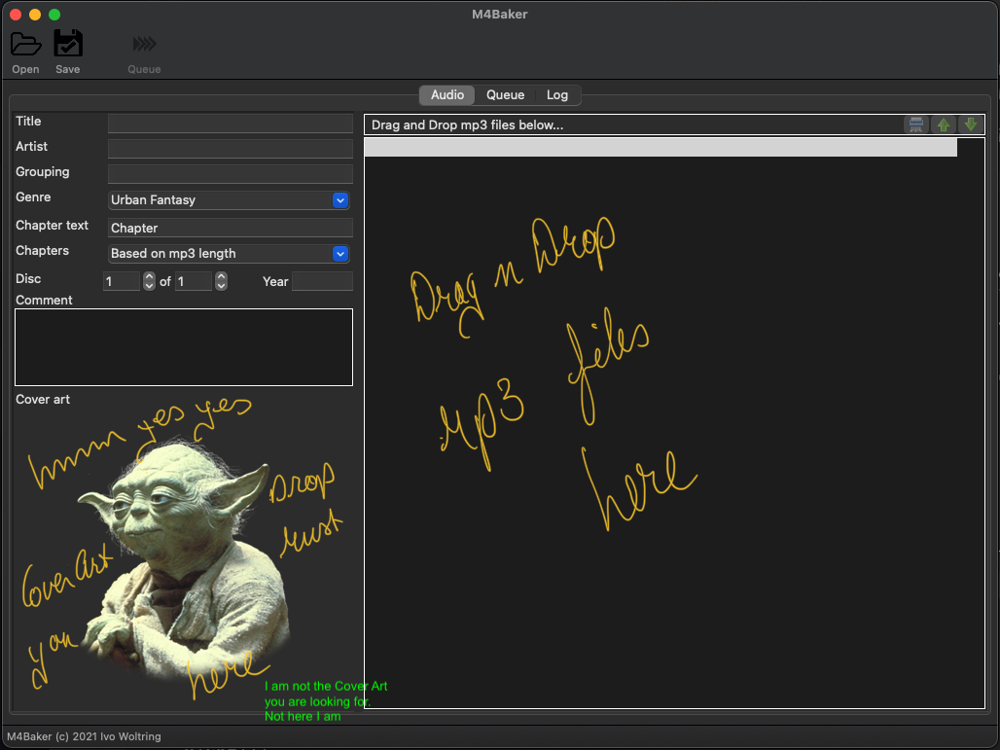
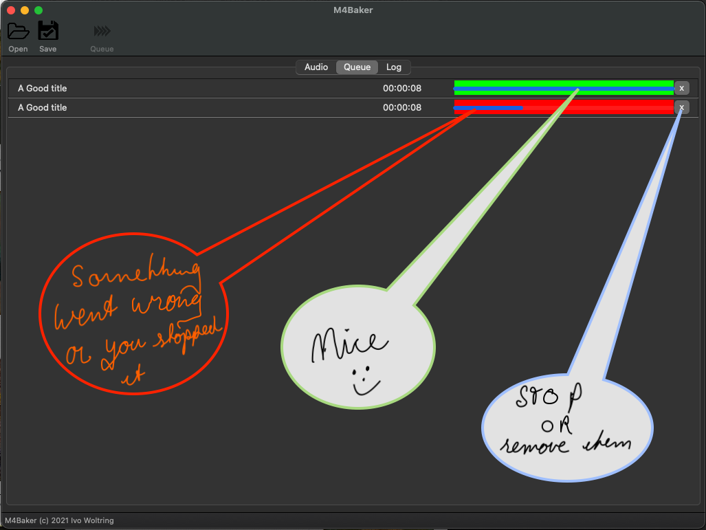

# M4B Baker

M4Baker bakes mp3 files to Audiobook format (m4b).

I am building it with my personal wishes and needs in mind as I am the developer and the main user :-)
The design is with ease of use in mind.



* Mandatory fields
    * Title
    * Artist
    * Cover Art
    * MP3 files
* When at least the mandatory fields are filled the "Queue" button will become available
* When Queued processing of the project will begin, and the current project windows will be cleaned to start a new one.
* The progress of all queued projects can be seen on the Queue tab.
* In theory, you can Queue as many projects as you want, depending on the capacity of your machine.



* Processes that are stopped (x) or have failed for some reason will show as in red
* Successfully completed projects will show up green.
* If a process has stopped you can use the (x) to remove it from the queue.

## Download release

* TODO no official release has been made yet als I am very much in testing phase now, but you can build from source. for
  instructions see the Developers section. Richt now I am building this with a MacBook in mind but as it is written in
  Python with wxPython it should be portable to Windows / Linux? I will probably not invest any time it porting, but if
  you want to collaborate or improve the code in any other way please drop me a PM on twitter @ivonet.

* As of version 0.1.2 (see tags) it should build into a fully working version with lots of rough edges (very alpha!)

# If you are a Developers

# # Requirements

- Python 3.9 (brew install python)

To be placed in src/resources:

- ffmpeg (brew install ffmpeg)
- mp4chaps (brew install mp4v2)
- mp4art (brew install mp4v2)
- AtomicParsley (brew install AtomicParsley)
- mp3binder (build from source: https://github.com/crra/mp3binder)

how...

```shell
cp -vf "$(which ffmpeg)" "./src/resources"
cp -vf "$(which ffprobe)" "./src/resources"
cp -vf "$(which mp4chaps)" "./src/resources"
cp -vf "$(which mp4art)" "./src/resources"
cp -vf "$(which AtomicParsley)" "./src/resources"
```

Not yet sure if I need them all but will adjust as needed :-)

## Create environment

To create and activate the environment

```shell
python3.9 -m venv venv
source venv/bin/activate
pip install poetry 
poetry install
```

## Usage

```shell
cd PROJECT
source venv/bin/activate
python src/m4baker.py
```

## Build Mac App

```shell
source venv/bin/activate
./build.sh [clean]
```

The clean option will first remove the build and dist folder before rendering all the images to the
ivonet/image/images.py file and building the application

See also the build.sh script

## Rendering the images

```shell
./images.sh
```

This script will convert all the ./images/*.{bmp,png} images to a format easily understood by wxPython.

## Collaboration

If you want to collaborate on this project to improve it or give in more functionality please drop me a PM on twitter (
@ivonet)

# See also

* Command line tool doing the [here](https://github.com/IvoNet/docker-mediatools/)
* [My Blog](https://www.ivonet.nl) 
